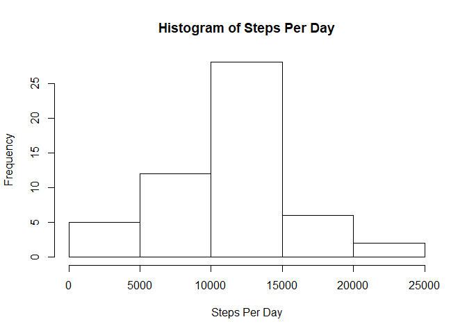

This is the peer-graded assignment for Coursera's "Reproducible Research", week 2.

This assignment makes use of data from a personal activity monitoring device. This device collects data at 5 minute intervals through out the day. The data consists of two months of data from an anonymous individual collected during the months of October and November, 2012 and include the number of steps taken in 5 minute intervals each day.

The variables included in this dataset are:

steps: Number of steps taking in a 5-minute interval (missing values are coded as NA)  
date: The date on which the measurement was taken in YYYY-MM-DD format  
interval: Identifier for the 5-minute interval in which measurement was taken.  

Below, I will be answering a series of questions posed in the assignment. Let's begin.

  
#### Loading and preprocessing the data  

```r
library(dplyr)
library(lattice)
data <- read.csv("activity.csv")
```
  
#### What is mean total number of steps taken per day?  
*Calculate the total number of steps taken per day:*

```r
perday <- group_by(data, date) %>% summarize(sum(steps))
```
  
*Make a histogram of the total number of steps taken each day:*

```r
hist(perday$`sum(steps)`, 
     xlab="Steps Per Day", 
     main="Histogram of Steps Per Day")
```

<!-- -->
  
*Calculate and report the mean and median of the total number of steps taken per day:*

```r
mean(perday$`sum(steps)`, na.rm=TRUE)
```

```
## [1] 10766.19
```

```r
median(perday$`sum(steps)`, na.rm=TRUE)
```

```
## [1] 10765
```
__Rounded to the nearest step, the mean steps taken per day is 10766, and the median steps taken per day is 10765.__  
  
  
#### What is the average daily activity pattern?
*Make a time series plot of the 5-minute interval (x-axis) and the average number of steps taken, averaged across all days (y-axis):*

```r
intavg <- group_by(data, interval) %>% 
          summarize(mean(steps, na.rm=TRUE))

plot(intavg, 
     type='l', 
     ylab="Average Steps")
```

<!-- -->

*Which 5-minute interval, on average across all the days in the dataset, contains the maximum number of steps?*

```r
intavg[which(intavg$`mean(steps, na.rm = TRUE)`
             == max(intavg$`mean(steps, na.rm = TRUE)`)),]
```

```
## # A tibble: 1 x 2
##   interval `mean(steps, na.rm = TRUE)`
##      <int>                       <dbl>
## 1      835                        206.
```
__The interval of 830-835 minutes contains the maximum average number of steps. This corresponds to the plot.__  

  
#### Imputing Missing Values
*Calculate and report the total number of missing values in the dataset*

```r
nrow(data)-sum(complete.cases(data))
```

```
## [1] 2304
```
__There are 2304 missing values in the dataset.__  

*Create a new dataset that is equal to the original dataset but with the missing data filled in:*

```r
filldata <- data
filldata$AvgIntSteps <- with(intavg, `mean(steps, na.rm = TRUE)`[match(filldata$interval, interval)] )
filldata[is.na(filldata[,1]),1] <- filldata[is.na(filldata[,1]),4]
```

*Make a histogram of the total number of steps taken each day* 

```r
fillperday <- group_by(filldata, date) %>% summarize(sum(steps))

hist(fillperday$`sum(steps)`, 
     xlab="Steps Per Day", 
     main="Histogram of Steps Per Day")
```

<!-- -->

*Calculate and report the mean and median total number of steps taken per day.*

```r
mean(fillperday$`sum(steps)`)
```

```
## [1] 10766.19
```

```r
median(fillperday$`sum(steps)`)
```

```
## [1] 10766.19
```
__Rounded to the nearest step, the mean is 10766 steps and the median is 10766 steps.__  

*Do these values differ from the estimates from the first part of the assignment? What is the impact of imputing missing data on the estimates of the total daily number of steps?*

```r
mean(fillperday$`sum(steps)`) - mean(perday$`sum(steps)`, na.rm=TRUE)
```

```
## [1] 0
```

```r
median(fillperday$`sum(steps)`) - median(perday$`sum(steps)`, na.rm=TRUE)
```

```
## [1] 1.188679
```
__The median differs slightly. The impact of imputing data is an increase in the median estimate. The mean is unaffected as I imputed missing values using mean values.__  

    
#### Are there differences in activity patterns between weekdays and weekends?
*Create a new factor variable in the dataset with two levels – “weekday” and “weekend” indicating whether a given date is a weekday or weekend day.*

```r
filldata2 <- filldata
filldata2$date <- as.Date(filldata2$date)
filldata2$dayofweek <- weekdays(filldata2$date)
filldata2 <- mutate(filldata2, "weekflag"=ifelse(dayofweek=="Sunday"|dayofweek=="Saturday", "weekend", "weekday"))
```

*Make a panel plot containing a time series plot (i.e. type="l") of the 5-minute interval (x-axis) and the average number of steps taken, averaged across all weekday days or weekend days (y-axis).*

```r
intavg2 <- group_by(filldata2, interval, weekflag) %>% 
  summarize(mean(steps))

xyplot(intavg2$'mean(steps)'~interval|weekflag, data=intavg2, t='l', ylab="Average Steps Taken", layout=c(1,2))
```

<!-- -->

__Yes, there are differences in activity patterns between weekdays and weekends.__
  
That concludes the assignment. Thank you for reading!


